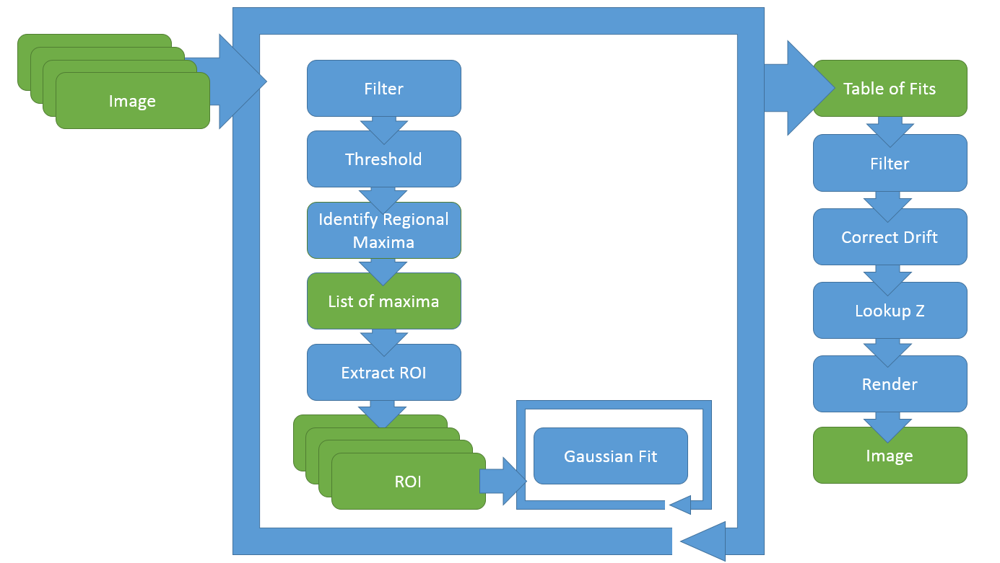
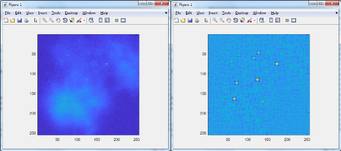
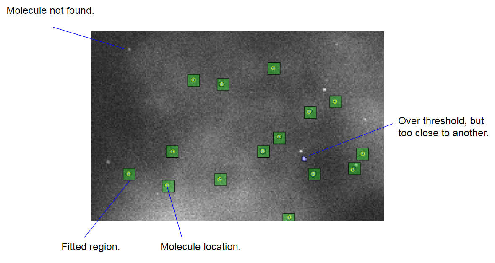

# LM Concept of Operation

*LM* implements a Photoactivated Localisation Microscopy (PALM) / Stochastic Recontruction Microscopy (STORM) -like algorithm based on the work of the inventors of [these techniques](https://en.wikipedia.org/wiki/Super-resolution_microscopy).

A series of diffraction-limited digital fluoresence microscope images are read, filtered and thresholded before local maxima are identified giving approximate locations of the molecules to be analysed. 

Regions of interest around these locations are then fitted to a 2D Gaussian function - the peak of which is at a super-resolution estimate of the location of the molecule. The resulting table of fits can then be filtered to remove bad fits, and otherwise corrected, before the super-resolved image is rendered, usually as a 2d histogram of the molecule locations.

## Reconstruction settings

The reconstruction process is controlled by several settings which must be tailored to each set of raw data / instrument.

Threshold
: How bright must a part of the image be to be considered for fitting?

Spacing
: How far apart must birght parts of the image be?

Filter
: What noise reducing and feature enhancing filter should be used? Options are 'off', 'gaussian' or 'LOG' (Laplacian of Gaussian).

Filter Width
: Essentially how big the molecules appear in the image, in pixels.

Graphics
: Should LM display graphics (annoated source frames) while reconstructing?

Display min and max
: If displaying frames what colour scale should be used.

Average Frames
: Should groups of frames be averaged whilst reconstructing?

Start and Stop frames
: Specify a subset of frames for analysis.