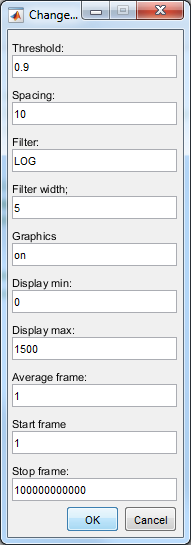

# LM Vignette

## Introduction

This vignette will walk through using *LM* to reconstruct some freely available simulated data which should be downloaded and unzipped from [EPFL](http://bigwww.epfl.ch/smlm/challenge2013/datasets/Tubulins_I/index.html).

## Running the scripts

You can edit and run the *LM* script to execute the code described below.

### Create a stack object

*LM* uses stack objects to represent series of images for reconstruction. As we are working from a folder full of *.TIFF* files, the first task is to specify where the files are, then build a list, then create the stack object from that list.


```
path='<<your path here>>';
myfilelist=LM_filelist(path);
mystack=LM_TIFFStack(myfilelist);
```

### Specify reconstruction settings

Next, we must specify the settings to use for the reconstruction. The easiest way to do this is with a dialog box:

```
myreconset=LM_dlgreconset();
```



This image shows sensible settings to use for the EPFL data - data from other sources will almost certainly need different settings.

### Reconstruct

Finally, we're ready to reconstruct an image. This is achieved by feeding the stack and reconstruction settings to the *LM_reconstruct* function. This function returns a list of where the software thinks the molecules in the images are located.

```
loc=LM_reconstruct(mystack,myreconset);
```

### View reconstruction

To see the reconstructed data as a Matlab figure, we call the LM_PrettyRender function. This needs the locations of the molecules and some information about the source image pixel size (150 nm in this case, but depends on the microscope used to obtain the data) and the pixel size required for the output image (10 nm). We also specify the colour range for the output - where we have 0 molecules the image will be darket and where we have 1500 it will be brightest.

```
imshow(LM_PrettyRender(loc,150,10),[0,1500]);
```